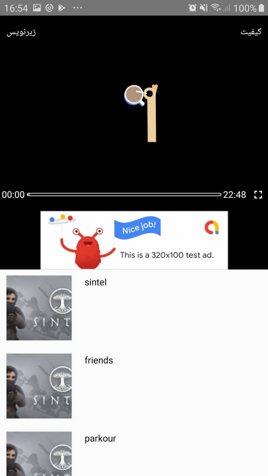
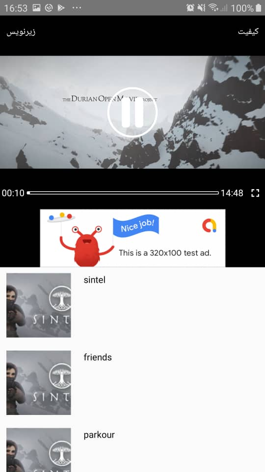

  

  <strong>react-native-video-controller</strong>

a controller for <code>react-native-video</code> 

---

# Motivation
There are two controller for the playing the video, but they are not customizable. This package tries to be as flexible as possible, and provide better controll over the video and other components beside the video.

# Features
* fullscreen mode will auto rotate the screen.( also rotation will trigger fullscreen mode).
* use custom components for play/pause/error/loading state of the player.
  
# Screen shots

<!-- 

 -->

# Peer Dependencies
this library depends on:

* `react-native-reanimated` if using the default slider,no need if you have your own slider.
* `react-native-gesture-handler` if using the default slider,no need if you have your own slider.
* `react-native-orientation` to handle rotations.
* `react-native-paper` to use the Menu component, no need if you have your own menu.
* `react-native-video` to play videos.
  

make sure install and link these packages.
# Docs and Usage
documnetation is created with [component-docs](https://github.com/callstack/component-docs) and lives [here](http://alikazemkhanloo.github.io/react-native-video-controller/video-player.html)
